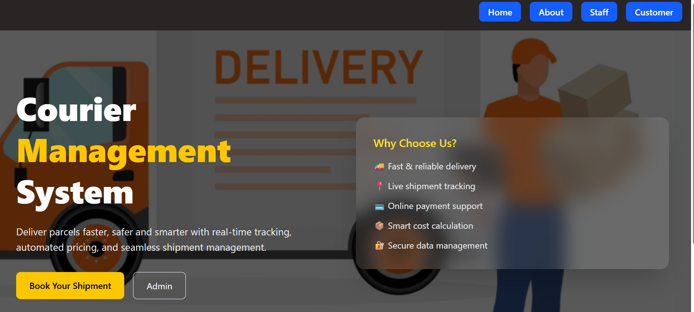
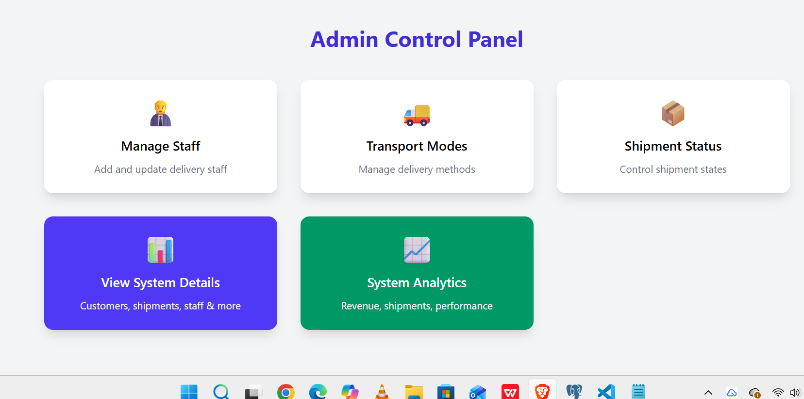
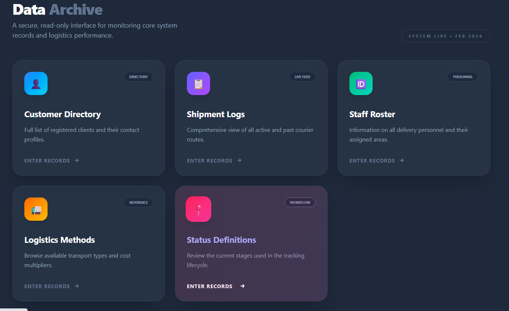
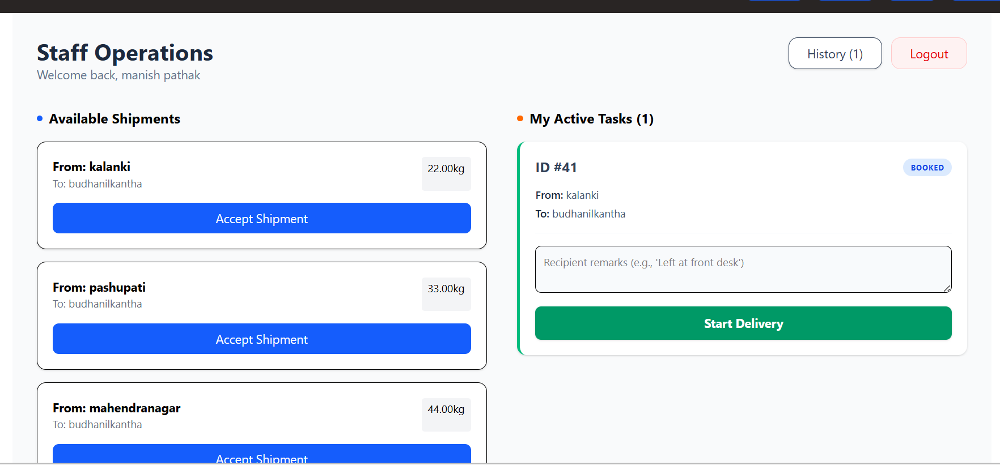
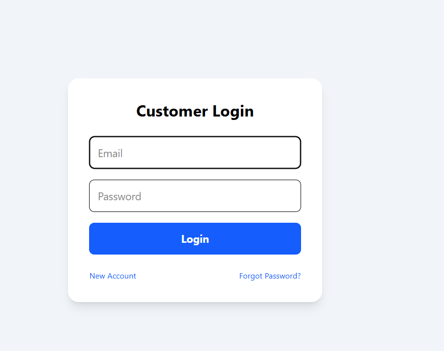

# 📦 Courier Management System

> A full-stack, production-ready parcel & logistics platform built for speed, scale, and real-world operations.

<div align="center">


### 🌐 Hosted Application

[](https://courier-system-two.vercel.app/)
[](http://courier-system-kf4b.onrender.com/)


</div>

---

## 📑 Table of Contents

<details open>
<summary>Click to expand</summary>

- [🌟 Overview](#-overview)
- [🎯 Problem & Solution](#-problem--solution)
- [✨ Key Features](#-key-features)
- [🛠️ Tech Stack](#️-tech-stack)
- [📋 Prerequisites](#-prerequisites)
- [⚡ Installation](#-installation)
- [🖼️ Frontend Showcase](#️-frontend-showcase)
- [📁 Project Structure](#-project-structure)
- [📡 API Endpoints](#-api-endpoints)
- [🔐 Security Features](#-security-features)
- [🤝 Contributing](#-contributing)
- [📝 License](#-license)
- [👨‍💻 Development Team](#-development-team)
- [📬 Contact & Support](#-contact--support)
- [🙏 Acknowledgments](#-acknowledgments)

</details>
---

## 🌟 Overview

Courier Management System is a comprehensive logistics solution that enables admins, staff, and customers to manage parcel delivery operations in real-time. Built with modern full-stack technologies, it emphasizes performance, security, and scalability for real-world courier businesses.

**From shipment creation to proof-of-delivery — everything is automated.**

---

## 🎯 Problem & Solution

<table>
<thead>
<tr>
<th>Challenge</th>
<th>Our Solution</th>
</tr>
</thead>
<tbody>
<tr>
<td>❌ Manual parcel tracking</td>
<td>✅ Real-time dashboards with live updates</td>
</tr>
<tr>
<td>❌ No delivery proof</td>
<td>✅ Photo & signature upload functionality</td>
</tr>
<tr>
<td>❌ Staff coordination issues</td>
<td>✅ Intelligent task claiming system</td>
</tr>
<tr>
<td>❌ Poor scalability</td>
<td>✅ Django + React architecture</td>
</tr>
</tbody>
</table>

---

## ✨ Key Features

### 👑 Admin Portal
- **Full Shipment Management** — Create, read, update shipments
- **Staff Management** — Assign roles and monitor performance
- **Analytics Dashboard** — Track KPIs and delivery metrics
- **Customer Management** — View and manage customer accounts

### 🚚 Staff Portal
- **Phone Number Authentication** — Quick and secure login
- **Task Claiming System** — Claim available deliveries
- **Real-time Updates** — Update shipment status on-the-go
- **Proof of Delivery** — Upload photos and signatures

### 📦 Customer Portal
- **Shipment Creation** — Book new deliveries instantly
- **Live Tracking** — Monitor delivery status in real-time
- **Delivery History** — Access complete shipment records

---

## 🛠️ Tech Stack

<table>
<tr>
<td width="50%">

**Backend**
- Django 4.2
- Django REST Framework
- PostgreSQL 15
- Session-based Authentication

</td>
<td width="50%">

**Frontend**
- React 18
- Vite
- Tailwind CSS
- Axios

</td>
</tr>
</table>

---

## 📋 Prerequisites

Before you begin, ensure you have the following installed:

- **Python** 3.9 or higher
- **Node.js** 16.x or higher
- **PostgreSQL** 15.x
- **npm** or **yarn**
- **Git**

---

## ⚡ Installation

### 1️⃣ Clone the Repository

```bash
git clone https://github.com/Sushil-Bhatta-sb/Courier-system.git
cd Courier-System
```

### 2️⃣ Backend Setup

```bash
# Navigate to backend directory
cd courier_management

# Create virtual environment
python -m venv venv

# Activate virtual environment
# On Windows:
venv\Scripts\activate
# On macOS/Linux:
source venv/bin/activate

# Install dependencies
pip install -r requirements.txt

# Configure environment variables (see Environment Variables section)
# Create a .env file in the courier_management directory

# Run migrations
python manage.py makemigrations
python manage.py migrate

# Create superuser for admin access
python manage.py createsuperuser

# Start development server
python manage.py runserver
```

> **Backend will be available at** `http://localhost:8000`

### 3️⃣ Frontend Setup

```bash
# Open new terminal and navigate to frontend directory
cd Courier_Frontendd

# Install dependencies
npm install

# Start development server
npm run dev
```

> **Frontend will be available at** `http://localhost:5173`

---

## 🖼️ Frontend Showcase
 
<table>
<thead>
<tr>
<th>Stage</th>
<th>Preview</th>
</tr>
</thead>
<tbody>
<tr>
<td>🚀 Home Page</td>
<td></td>
</tr>
<tr>
<td>🚀 Admin Portal</td>
<td></td>
</tr>
<tr>
<td>🚀 Detail Section</td>
<td></td>
</tr>
<tr>
<td>🚀 Staff Portal</td>
<td></td>
</tr>
<tr>
<td>🚀 Customer Login</td>
<td></td>
</tr>
<tr>
<td>🚀 Customer Dashboard</td>
<td></td>
</tr>
</tbody>
</table>

## 📁 Project Structure

```
Courier-System/
│
├── Courier_Frontendd/                    # Frontend application
│   ├── src/
│   │   ├── assets/                       # Images, icons, static files
│   │   ├── auth/                         # Authentication components
│   │   ├── components/                   # Reusable UI components
│   │   ├── pages/                        # Page components
│   │   ├── App.jsx                       # Main app component
│   │   └── main.jsx                      # Entry point
│   ├── package.json                      # Frontend dependencies
│   └── vite.config.js                    # Vite configuration
│
├── courier_management/                   # Backend application
│   ├── courier/                          # Main Django app
│   │   ├── migrations/                   # Database migrations
│   │   ├── models.py                     # Data models
│   │   ├── views.py                      # API views
│   │   ├── urls.py                       # URL routing
│   │   
│   │
│   ├── courier_management/               # Project settings
│   │   ├── settings.py                   # Django settings
│   │   ├── urls.py                       # Root URL config
│   │   └── wsgi.py                       # WSGI config
│   │
│   ├── media/                            # Uploaded files
│   ├── db.sqlite3                        # SQLite database (dev)
│   ├── manage.py                         # Django CLI
│   └── requirements.txt                  # Python dependencies
│
└── README.md                             # Project documentation
```

---

## 📡 API Endpoints

### Authentication

<table>
<thead>
<tr>
<th>Method</th>
<th>Endpoint</th>
<th>Description</th>
</tr>
</thead>
<tbody>
<tr>
<td><code>POST</code></td>
<td><code>/api/staff_login/</code></td>
<td>Staff authentication via phone number</td>
</tr>
<tr>
<td><code>POST</code></td>
<td><code>/api/customer_login/</code></td>
<td>Customer authentication</td>
</tr>
<tr>
<td><code>POST</code></td>
<td><code>/api/logout/</code></td>
<td>User logout</td>
</tr>
</tbody>
</table>

### Customer Management

<table>
<thead>
<tr>
<th>Method</th>
<th>Endpoint</th>
<th>Description</th>
</tr>
</thead>
<tbody>
<tr>
<td><code>POST</code></td>
<td><code>/api/add_customer/</code></td>
<td>Register new customer</td>
</tr>
<tr>
<td><code>GET</code></td>
<td><code>/api/get_customers/</code></td>
<td>Fetch all customers</td>
</tr>
</tbody>
</table>

### Shipment Management

<table>
<thead>
<tr>
<th>Method</th>
<th>Endpoint</th>
<th>Description</th>
</tr>
</thead>
<tbody>
<tr>
<td><code>GET</code></td>
<td><code>/api/get_shipments/</code></td>
<td>Fetch all shipments</td>
</tr>
<tr>
<td><code>POST</code></td>
<td><code>/api/create_shipment/</code></td>
<td>Create new shipment</td>
</tr>
<tr>
<td><code>GET</code></td>
<td><code>/api/get_shipment/&lt;id&gt;/</code></td>
<td>Get shipment details</td>
</tr>
</tbody>
</table>

### Delivery Operations

<table>
<thead>
<tr>
<th>Method</th>
<th>Endpoint</th>
<th>Description</th>
</tr>
</thead>
<tbody>
<tr>
<td><code>POST</code></td>
<td><code>/api/claim_shipment/</code></td>
<td>Staff claims delivery task</td>
</tr>
<tr>
<td><code>POST</code></td>
<td><code>/api/update_shipment_status/</code></td>
<td>Update delivery status</td>
</tr>
<tr>
<td><code>POST</code></td>
<td><code>/api/upload_proof/</code></td>
<td>Upload proof of delivery</td>
</tr>
</tbody>
</table>

---

## 🔐 Security Features

- ✅ **CSRF Protection** — Enabled for all state-changing operations
- ✅ **Server-side Validation** — All inputs validated on backend
- ✅ **Session-based Authentication** — Secure user sessions
- ✅ **Media File Isolation** — Uploaded files stored securely
---

## 🤝 Contributing

We welcome contributions! Please follow these steps:

1. **Fork the repository**
2. **Create a feature branch**
   ```bash
   git checkout -b feature/amazing-feature
   ```
3. **Commit your changes**
   ```bash
   git commit -m "Add amazing feature"
   ```
4. **Push to the branch**
   ```bash
   git push origin feature/amazing-feature
   ```
5. **Open a Pull Request**

### Code Style Guidelines
- Follow PEP 8 for Python code
- Use ESLint configuration for JavaScript
- Write meaningful commit messages
- Add tests for new features

---

## 📝 License

This project is licensed under the MIT License - see the [LICENSE](LICENSE) file for details.

---

## 👨‍💻 Development Team

<table>
<tr>
<td align="center">
<br />
<sub><b>Sushil Bhatta</b></sub><br />
<a href="https://github.com/Sushil-Bhatta-sb">GitHub</a>
</td>
<td align="center">
<br />
<sub><b>Subodh Bhatta</b></sub><br />
<a href="https://github.com/socode6">GitHub</a>
</td>
</tr>
</table>

---

## 📬 Contact & Support

- **GitHub**: [@sushilbhatt567](https://github.com/Sushil-Bhatta-sb), [@socode6](https://github.com/socode)
- **Twitter/X**: [@sushilbhatt567](https://twitter.com/sushilbhatt567)
- **Email**: bhattsushil567@gmail.com

---

## 🙏 Acknowledgments

- Django and React communities for excellent documentation
- All contributors who helped improve this project
- Open source libraries that made this possible

---

<div align="center">

**⭐ If you find this project useful, please give it a star!**

Made with ❤️ in Nepal 🇳🇵

</div>
